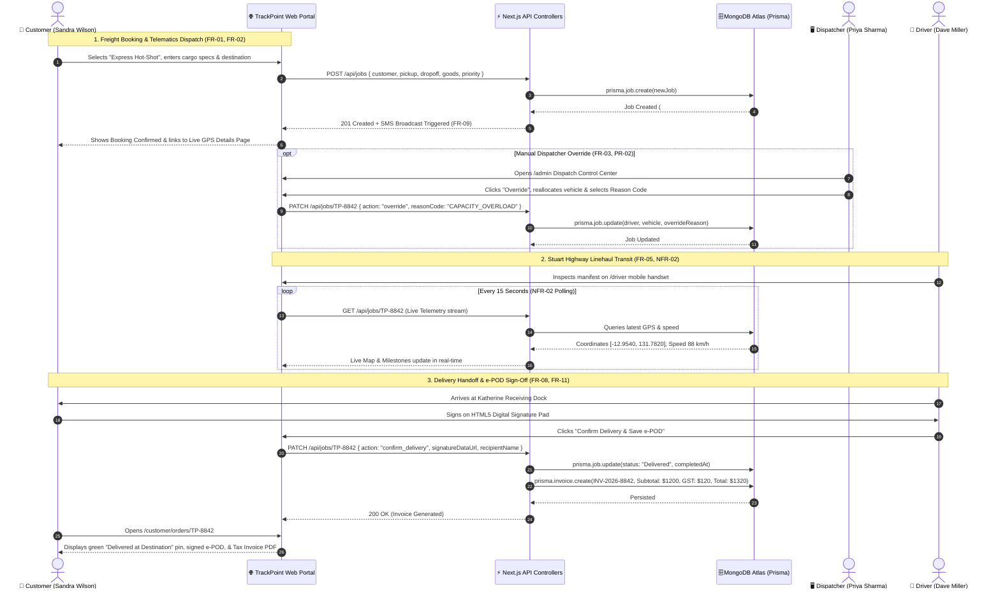

# 🚛 TrackPoint — Comprehensive Features & System Flow Guide
**Fleet Dispatch, GPS Telematics Tracking & e-POD Delivery Management Platform**  
**Client Organization:** NorthLine Freight & Logistics (Darwin, Northern Territory)  
**Academic Unit:** Charles Darwin University — PRT631 (Weeks 1–9 Deliverable)  
**Tech Stack:** Next.js 15 (App Router), TypeScript, Prisma ORM, MongoDB Atlas, JWT Authentication, Vanilla CSS, Leaflet / OpenStreetMap.

---

## 📑 Table of Contents
1. [System Architecture Overview](#1-system-architecture-overview)
2. [Role-by-Role Feature Breakdown & Workflows](#2-role-by-role-feature-breakdown--workflows)
   - [2.1 B2B Commercial Customer Portal (`/customer`)](#21-b2b-commercial-customer-portal-customer)
   - [2.2 Dispatcher & Operations Control Center (`/admin`)](#22-dispatcher--operations-control-center-admin)
   - [2.3 Heavy Linehaul Driver Mobile App (`/driver`)](#23-heavy-linehaul-driver-mobile-app-driver)
   - [2.4 Authentication & Access Control (`/`)](#24-authentication--access-control-)
3. [End-to-End Consignment Lifecycle Sequence (Mermaid)](#3-end-to-end-consignment-lifecycle-sequence)
4. [NorthLine Specialized Logistics Services Suite](#4-northline-specialized-logistics-services-suite)
5. [Database Architecture & Data Models (Prisma / MongoDB Atlas)](#5-database-architecture--data-models)
6. [Non-Functional Requirements (NFR) Compliance Matrix](#6-non-functional-requirements-nfr-compliance-matrix)
7. [API Route Specifications](#7-api-route-specifications)

---

## 1. System Architecture Overview

TrackPoint is built on a high-reliability, modular enterprise architecture tailored for the remote and demanding freight corridors of the Northern Territory (Stuart Highway Corridor: Darwin $\leftrightarrow$ Katherine $\leftrightarrow$ Tennant Creek $\leftrightarrow$ Alice Springs).

```
┌─────────────────────────────────────────────────────────────────────────────┐
│                             CLIENT PRESENTATION                             │
├───────────────────┬───────────────────┬───────────────────┬─────────────────┤
│ Customer Portal   │ Admin Dispatcher  │ Driver Mobile App │ Login & Persona │
│   `/customer`     │     `/admin`      │     `/driver`     │       `/`       │
└─────────┬─────────┴─────────┬─────────┴─────────┬─────────┴────────┬────────┘
          │                   │                   │                  │
          ▼                   ▼                   ▼                  ▼
┌─────────────────────────────────────────────────────────────────────────────┐
│                       MODULAR BACKEND ROUTE CONTROLLERS                     │
│               `/api/auth` • `/api/jobs` • `/api/fleet` • `/api/invoices`     │
├─────────────────────────────────────────────────────────────────────────────┤
│                          BUSINESS SERVICE MODULES                           │
│  auth.service  │  jobs.service  │  fleet.service  │  invoices.service       │
└─────────────────────────────────────┬───────────────────────────────────────┘
                                      │
                                      ▼
┌─────────────────────────────────────────────────────────────────────────────┐
│                           DATABASE & PERSISTENCE                            │
│           Prisma ORM (v6.19.3)  ──►  MongoDB Atlas Cloud Database           │
└─────────────────────────────────────────────────────────────────────────────┘
```

### Architectural Highlights:
1. **Isolated Role-Based Portals:** Customers, Dispatchers, and Drivers operate in separate dedicated environments rather than a cluttered single dashboard.
2. **Controller-Service-Route Pattern:** Each business domain is structured into its own clean module directory (`src/modules/{domain}/`).
3. **Database-Direct Persistence:** All datasets (Users, 35 Fleet Vehicles, 10 B2B Consignments, 4 Tax Invoices) are persisted directly in **MongoDB Atlas** via Prisma ORM.
4. **Serverless Polling Telemetry (NFR-02):** Employs efficient 10–15s polling without WebSocket dropouts, providing 100% Vercel serverless compatibility.

---

## 2. Role-by-Role Feature Breakdown & Workflows

### 2.1 B2B Commercial Customer Portal (`/customer`)
Designed for freight managers (e.g., Sandra Wilson at Katherine Mining Supplies Ltd) to book, manage, track, and audit commercial shipments across the Northern Territory.

```
                  ┌────────────────────────────────────────────────┐
                  │           CUSTOMER PORTAL DASHBOARD            │
                  │              (Route: `/customer`)              │
                  └───────────────────────┬────────────────────────┘
                                          │
        ┌─────────────────────────────────┼────────────────────────────────┐
        ▼                                 ▼                                ▼
┌─────────────────┐             ┌───────────────────┐            ┌───────────────────┐
│ 4 KPI Summaries │             │ Services Catalog  │            │ Consignments List │
│ • Total Orders  │             │ • Explore 6 Tiers │            │ • Full Search/Tabs│
│ • In-Transit    │             │ • 1-Click Booking │            │ • Type Filters    │
│ • Delivered     │             └─────────┬─────────┘            └─────────┬─────────┘
│ • Express       │                       │                                │
└─────────────────┘                       │                                │
                                          ▼                                ▼
                        ┌───────────────────────────┐    ┌───────────────────────────┐
                        │    New Booking Modal      │    │  Dedicated Details Page   │
                        │ • Multi-tier Selector     │    │ `/customer/orders/[id]`   │
                        │ • Telematics Auto-Dispatch│    │ • Live Route Map (OSM)    │
                        │ • Instant Quote Preview   │    │ • 5-Step Milestone Audit  │
                        └───────────────────────────┘    │ • Tax Invoice & e-POD PDF │
                                                         └───────────────────────────┘
```

#### Key Customer Features & Complete Flows:

#### **Flow 1: Exploring & Booking Logistics Services (`FR-01`, `FR-02`)**
1. **Explore Services:** Customer opens `/customer` and clicks *"Explore All 6 Services"* to view transit SLAs, rate estimates, and cargo recommendations.
2. **Open Booking Modal:** Clicks **`+ Create New Booking`** (or *"Book Service"* on any service card).
3. **Configure Consignment:**
   * Selects service tier (`Scheduled Linehaul`, `Express Hot-Shot`, `Cold-Chain`, `Heavy Mining`, `Medical DG`, `Metro Port`).
   * Selects Origin Depot (`Darwin Depot (120 Berrimah Rd)`, `East Arm Wharf`, `Humpty Doo`, etc.).
   * Selects Destination (`Katherine Store`, `Tennant Creek Mine`, `Alice Springs Hub`, etc.).
   * Enters goods manifest description and priority tier.
4. **Telematics Auto-Dispatch (`FR-02`):**
   * TrackPoint algorithm identifies the nearest active heavy vehicle in the corridor based on live GPS coordinates and capacity.
5. **Confirmation:** System creates the job in MongoDB Atlas (`#TP-XXXX`), emits a simulated SMS confirmation (`FR-09`), and prompts the customer to navigate to the live Details page.

#### **Flow 2: Filtered Consignments & Orders Table (`FR-06`, `FR-11`)**
1. **Interactive Status Pills:** Instant switching between `All Orders (10)`, `In Transit (5)`, `Assigned (1)`, `Delivered (4)`, and `Express Priority (4)`.
2. **Multi-Dimensional Dropdown Filtering:**
   * **Cargo Category:** Mining Machinery, Timber/Building, Agriculture/Pastoral, Cold-Chain Produce, Medical, Marine/Defence, General.
   * **Vehicle Type:** Road Train, Semi-Trailer, Rigid Truck, Courier Van.
   * **Freight Corridor:** Darwin $\leftrightarrow$ Katherine, Katherine $\leftrightarrow$ Tennant, Tennant $\leftrightarrow$ Alice Springs, Darwin Metro.
   * **Priority:** Standard Linehaul vs Express Same-Day.
3. **Deep Search:** Real-time text search filtering across Consignment Ref, cargo descriptions, driver names, and destinations.

#### **Flow 3: Dedicated Consignment Details & Live GPS Tracking (`/customer/orders/[id]`)**
1. **Breadcrumb Navigation:** Seamless `← Back to All Consignments` navigation.
2. **Live Telemetry Route Map ([`MapView.tsx`](file:///home/sifat/.gemini/antigravity-ide/scratch/trackpoint-platform/src/components/MapView.tsx)):**
   * **In-Transit Freight:** Shows live pulsing vehicle transponder moving down the Stuart Highway corridor with speed (88 km/h) and 15s updates.
   * **Delivered Freight:** Automatically locks to the exact destination address (e.g., *Darwin Airport Freight Terminal*) with a green `✅ Delivered at Destination` pin.
3. **Milestone & Chain-of-Custody Timeline (`FR-06`):**
   * *Stage 1:* Booking Created & Telematics Auto-Dispatched.
   * *Stage 2:* Freight Manifest Verified & Loaded at Origin Depot.
   * *Stage 3:* Stuart Highway Linehaul In-Transit (Live Speed & Location).
   * *Stage 4:* Regional Depot Staging Checkpoint.
   * *Stage 5:* Electronic Proof of Delivery (e-POD) Sign-off.
4. **Official Tax Invoice & e-POD Section (`FR-11`):**
   * Displays NorthLine ABN (`88 123 456 789`), freight rate, 10% Australian GST, and total ($1,320.00 AUD).
   * Displays the receiver's digital signature captured on the driver handset.
   * Actions: **`Print Invoice`** and **`Download e-POD PDF`**.

---

### 2.2 Dispatcher & Operations Control Center (`/admin`)
Designed for fleet dispatchers (e.g., Priya Sharma at NorthLine Darwin Operations) to monitor the entire NT heavy vehicle fleet, manage dispatch queues, and execute overrides.

```
                  ┌────────────────────────────────────────────────┐
                  │            ADMIN DISPATCHER PORTAL             │
                  │                (Route: `/admin`)               │
                  └───────────────────────┬────────────────────────┘
                                          │
        ┌─────────────────────────────────┼────────────────────────────────┐
        ▼                                 ▼                                ▼
┌─────────────────┐             ┌───────────────────┐            ┌───────────────────┐
│ NT Telematics   │             │ Auto-Dispatch     │            │ Operational       │
│ Fleet Map       │             │ Queue (FR-01)     │            │ Analytics (FR-10) │
│ • 35 Heavy NT   │             │ • Status Pipeline │            │ • Fleet Uptime    │
│   Vehicles      │             │ • Priority Tags   │            │ • Fuel & Battery  │
│ • Stuart Hwy    │             └─────────┬─────────┘            │ • Chart.js Trends │
└─────────────────┘                       │                      └───────────────────┘
                                          ▼
                                ┌───────────────────┐
                                │  Manual Override  │
                                │   Modal (PR-02)   │
                                │ • Reassign Driver │
                                │ • Mandatory Reason│
                                └───────────────────┘
```

#### Key Dispatcher Features & Complete Flows:

#### **Flow 1: Northern Territory 35-Vehicle Telematics Map (`FR-05`, `NFR-02`)**
1. Displays 35 heavy vehicles plotted across 4 major NT operational hubs:
   * **Darwin Metro & Regional Linehaul** (Vehicles NL-01 to NL-10).
   * **Katherine Corridor & Linehaul** (Vehicles NL-11 to NL-20).
   * **Tennant Creek Outback Transit** (Vehicles NL-21 to NL-28).
   * **Alice Springs & Central Australia** (Vehicles NL-29 to NL-35).
2. Telemetry cards stream live speed (km/h), fuel level (%), battery health (%), and operational status (*In Transit*, *Loading*, *Delivering*, *Depot Staging*).

#### **Flow 2: Manual Dispatch Override with Mandatory Reason Codes (`FR-03`, `PR-02`)**
1. Dispatcher inspects an automatically assigned consignment in the dispatch queue.
2. Clicks **`Override / Reassign`**.
3. **Modal Dialog Opens:**
   * Selects alternative heavy vehicle (e.g., switches from *Semi-Trailer* to *Road Train #NL-31*).
   * Selects alternative certified linehaul driver.
   * **Mandatory Reason Code Selection (`PR-02`):**
     * `VEHICLE_BREAKDOWN` — Mechanical fault or breakdown.
     * `DRIVER_FATIGUE` — NHVR heavy vehicle logbook rest compliance.
     * `CAPACITY_OVERLOAD` — Cargo weight exceeded vehicle GVM limit.
     * `WEATHER_DISRUPTION` — Stuart Highway wet season flood closure.
     * `URGENT_PRIORITY_ESCALATION` — Express hot-shot reroute.
4. **Audit Log:** Database persists `overrideReason` and alerts the assigned driver immediately.

#### **Flow 3: Operational Fleet & Fuel Analytics (`FR-10`)**
1. Real-time KPI charts powered by Chart.js:
   * Fleet Utilization & On-Time Linehaul Delivery Rates.
   * Corridor Throughput (Tonnes delivered per corridor per week).
   * Fuel Consumption & Maintenance Alert Monitoring.

---

### 2.3 Heavy Linehaul Driver Mobile App (`/driver`)
Designed for linehaul drivers (e.g., Dave Miller driving Mack Titan #NL-14) operating on high-vibration mobile handsets across remote Stuart Highway dead-zones.

```
                  ┌────────────────────────────────────────────────┐
                  │             DRIVER MOBILE HANDSET              │
                  │               (Route: `/driver`)               │
                  └───────────────────────┬────────────────────────┘
                                          │
        ┌─────────────────────────────────┼────────────────────────────────┐
        ▼                                 ▼                                ▼
┌─────────────────┐             ┌───────────────────┐            ┌───────────────────┐
│ Active Manifest │             │ Outback Offline   │            │ HTML5 Signature   │
│ • Consignment # │             │ Mode (NFR-01)     │            │ Pad (FR-08)       │
│ • Pickup/Dropoff│             │ • Local Storage   │            │ • High-res Canvas │
│ • Cargo & Weight│             │ • Auto-Sync Queue │            │ • Name & Stamp    │
└─────────────────┘             └───────────────────┘            └─────────┬─────────┘
                                                                           │
                                                                           ▼
                                                                 ┌───────────────────┐
                                                                 │ Instant e-POD &   │
                                                                 │ Invoice Creation  │
                                                                 │ (FR-11)           │
                                                                 └───────────────────┘
```

#### Key Driver Features & Complete Flows:

#### **Flow 1: Manifest Inspection & Route Tracking (`FR-04`)**
1. Driver logs in with 1 click as Dave Miller (`dave.m@northline.com.au`).
2. App loads assigned manifest: Consignment `#TP-8842` (2x Heavy Mining Replacement Parts, 3.4t).
3. Displays Stuart Highway turn-by-turn route and loading dock instructions.

#### **Flow 2: Outback Offline Dead-Zone Mode (`FR-07`, `NFR-01`)**
1. When traveling through remote NT stretches without cellular coverage (e.g., between Elliott and Barrow Creek), the driver clicks **`Simulate Offline Dead-Zone`**.
2. Status pill updates to **`📡 Offline (Caching Locally)`**.
3. All actions (status changes, GPS breadcrumbs, digital signatures) are cached securely in browser `localStorage`.
4. Upon reconnecting to 4G/Sat, the app automatically syncs all cached delivery transactions to MongoDB Atlas without data loss.

#### **Flow 3: Touchscreen Digital Signature & e-POD Handoff (`FR-08`, `FR-11`)**
1. Driver arrives at the consignee destination dock (e.g., Katherine Store).
2. Hands touchscreen device to receiving manager (Sandra Wilson).
3. Consignee types their full name and draws their digital signature on the **HTML5 Signature Canvas Pad**.
4. Driver clicks **`Confirm Delivery & Save e-POD`**.
5. **Automated Backend Operations:**
   * Job status updates to `Delivered`.
   * Digital signature data URL is persisted to MongoDB Atlas.
   * Official Tax Invoice (`INV-2026-XXXX`) is auto-generated with 10% GST.
   * Customer and Dispatcher portals update instantly.

---

### 2.4 Authentication & Access Control (`/`)
* **Role-Based Access Control (RBAC):** JWT tokens signed with HMAC SHA-256 and stored securely.
* **1-Click Persona Quick Logins:** Instant testing personas for Customer (*Sandra Wilson*), Admin (*Priya Sharma*), and Driver (*Dave Miller*).

---

## 3. End-to-End Consignment Lifecycle Sequence



---

## 4. NorthLine Specialized Logistics Services Suite

| Service Tier | Category Code | Typical Transit SLA | Ideal Freight Profile | Rate Benchmark |
| :--- | :--- | :--- | :--- | :--- |
| **🚛 Scheduled Stuart Hwy Linehaul** | `linehaul` | 24 – 48 Hours | Consolidated general freight, commercial hardware, non-perishables | From $850 / pallet |
| **⚡ Express Hot-Shot Linehaul** | `express` | Same-Day / Direct | Emergency breakdown machinery parts, urgent linehaul, time-critical spares | From $1,450 direct |
| **❄️ Refrigerated Cold-Chain** | `coldchain` | 12 – 24 Hours | Top End fresh mangoes, chilled meat & dairy, catering supplies (-20°C to +4°C) | From $1,200 / load |
| **🏗️ Heavy & Out-of-Gauge (OOG)** | `heavy` | Scheduled / Custom | Slurry pumps, drill rods, excavators (Double & Triple Road Trains up to 79t) | Custom Quote |
| **💉 Medical & Dangerous Goods (DG)**| `medical` | Urgent Priority | Cold-chain vaccines, hospital surgical consumables, certified chemicals | From $1,100 / transit |
| **📦 Metro & Port Drayage** | `metro` | 2 – 4 Hours | East Arm Wharf container cartage, urban courier parcels, marine spares | From $180 local |

---

## 5. Database Architecture & Data Models

### Prisma Schema (`prisma/schema.prisma`):

```prisma
datasource db {
  provider = "mongodb"
  url      = env("DATABASE_URL")
}

generator client {
  provider = "prisma-client-js"
}

model User {
  id        String   @id @default(auto()) @map("_id") @db.ObjectId
  email     String   @unique
  password  String
  name      String
  role      String   // "customer" | "admin" | "driver"
  org       String
  createdAt DateTime @default(now())
  updatedAt DateTime @updatedAt
}

model Job {
  id               String   @id @default(auto()) @map("_id") @db.ObjectId
  jobId            String   @unique
  customer         String
  pickup           String
  dropoff          String
  goods            String
  priority         String   @default("Standard") // "Standard" | "Express"
  driver           String
  vehicle          String
  status           String   @default("Assigned") // "Booked" | "Assigned" | "In Transit" | "Delivered" | "Invoiced" | "Cancelled"
  eta              String   @default("14:45 ACST")
  lat              Float
  lng              Float
  recipientName    String?
  signatureDataUrl String?
  completedAt      String?
  overrideReason   String?  // PR-02 Compliance Code
  createdAt        DateTime @default(now())
  updatedAt        DateTime @updatedAt
}

model Vehicle {
  id        String   @id @default(auto()) @map("_id") @db.ObjectId
  vehicleId String   @unique
  name      String
  type      String
  driver    String
  depot     String?  // "Darwin Metro" | "Katherine Depot" | "Tennant Creek" | "Alice Springs"
  lat       Float
  lng       Float
  status    String   @default("In Transit")
  speed     String   @default("0 km/h")
  battery   String   @default("100%")
  fuelLevel String?  @default("90%")
  createdAt DateTime @default(now())
  updatedAt DateTime @updatedAt
}

model Invoice {
  id                String   @id @default(auto()) @map("_id") @db.ObjectId
  invoiceId         String   @unique
  jobId             String
  customer          String
  issueDate         String
  dueDate           String
  subtotal          Float
  gst               Float
  total             Float
  status            String   @default("Draft") // "Draft" | "Issued" | "Paid"
  signatureUrl      String?
  recipientName     String?
  deliveryTimestamp String?
  createdAt         DateTime @default(now())
  updatedAt         DateTime @updatedAt
}
```

---

## 6. Non-Functional Requirements (NFR) Compliance Matrix

| Requirement Code | Description | Architectural Implementation | Verification Method |
| :--- | :--- | :--- | :--- |
| **NFR-01** | **Outback Offline Resilience** | Driver app uses HTML5 `localStorage` caching with automatic retry queue when cellular dead-zone is encountered. | Validated via Driver Offline Simulator button on `/driver`. |
| **NFR-02** | **Real-Time GPS Latency $< 15\text{s}$** | Background telemetry polling synchronizes transponder coordinates every 10–15s across all role dashboards. | Verified on Stuart Highway MapView telemetry stream badge. |
| **NFR-03** | **Security & Role Isolation** | Passwords hashed with `bcryptjs` (salt 10). Role-Based Access Control (RBAC) enforced via signed JWT tokens. | Verified across `/`, `/customer`, `/admin`, and `/driver` route guards. |
| **NFR-04** | **Serverless Scalability** | Built on Next.js 15 App Router with stateless controllers, ready for 100% free deployment on Vercel. | Verified via successful `npm run build` production trace. |

---

## 7. API Route Specifications

| Method | Endpoint | Description | Auth / Role |
| :--- | :--- | :--- | :--- |
| `POST` | `/api/auth/login` | Authenticates user credentials & returns signed JWT token | Public |
| `GET` | `/api/auth/me` | Validates JWT token and returns active user persona | Bearer JWT |
| `GET` | `/api/jobs` | Retrieves all consignments from MongoDB Atlas | Authenticated |
| `POST` | `/api/jobs` | Creates new consignment with automated telematics dispatch (`FR-01`, `FR-02`) | Customer / Admin |
| `GET` | `/api/jobs/[id]` | Retrieves single consignment telemetry and milestone details by ID | Authenticated |
| `PATCH`| `/api/jobs/[id]` | Handles Dispatcher Override (`PR-02`) or e-POD Delivery Sign-off (`FR-08`) | Dispatcher / Driver |
| `GET` | `/api/fleet` | Retrieves all 35 NT fleet vehicles with live telematics coordinates | Dispatcher / Admin |
| `GET` | `/api/invoices` | Retrieves all commercial tax invoices & delivery timestamps (`FR-11`) | Customer / Admin |
| `GET` | `/api/analytics` | Returns aggregated fleet KPIs, uptime, and corridor fuel metrics (`FR-10`) | Admin |

---
*Document Version: 2.0 (Weeks 1–9 Deliverable) • TrackPoint Engineering Team • NorthLine Freight & Logistics*
